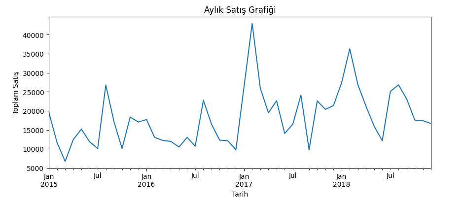

# superstore_analysis_v1
Python ile Superstore veri analizi

# 📊 Superstore Satış Analizi - v2

Bu proje, Superstore satış verileri üzerinde yapılan temel veri analizi çalışmasını içermektedir.  
Veri analizi Google Colab ortamında gerçekleştirilmiş, sonuçlar grafiklerle desteklenmiştir.

---

## 🔍 Kullanılan Teknolojiler

- Python 🐍
- Pandas
- Matplotlib
- Google Colab
- GitHub

---

## 📁 Veri Seti

Veri seti `train.csv` adlı dosyadan alınmıştır ve aşağıdaki sütunları içermektedir:

- Order Date
- City
- Category
- Sub-Category
- Sales
- Region
- Customer Info

---

## 📈 Yapılan Analizler

1. 📍 **En çok satış yapılan ilk 5 şehir**
2. 📊 **Kategoriye göre toplam satış analizi**
3. 📆 **Aylık toplam satış grafiği (resample yöntemiyle)**
4. 🔎 Eksik veri ve tarih biçimi kontrolü (`errors='coerce'` kullanıldı)

---

## 📸 Örnek Grafik

---

## 🚀 Nasıl Kullanılır?

1. Bu repoyu `git clone` ile bilgisayarına çekin.
2. `superstore_analysis_v2.ipynb` dosyasını Google Colab ya da Jupyter Notebook ile açın.
3. Gerekli kütüphaneleri yükleyin ve hücreleri çalıştırın.

---

## 📌 Notlar

- Bu analiz, başlangıç düzeyinde veri görselleştirme ve zaman serisi analizi çalışmasıdır.
- Daha ileri analizler (ortalama teslim süresi, segment bazlı müşteri analizi vb.) bir sonraki sürümde planlanmaktadır.

---

## 👨‍💻 Geliştirici

- Yasin Bağrıaçık  
- [GitHub Profilim](https://github.com/yassinbagriacik)

---
