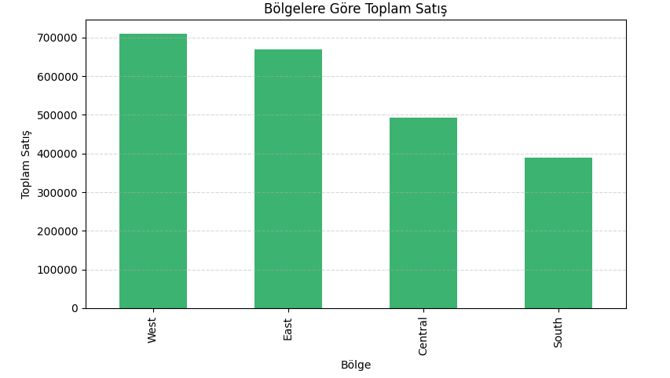
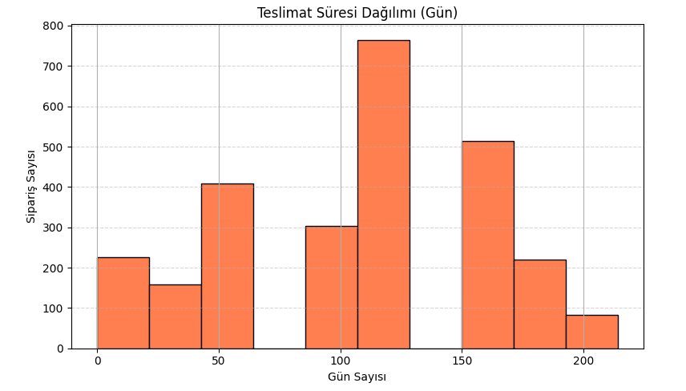
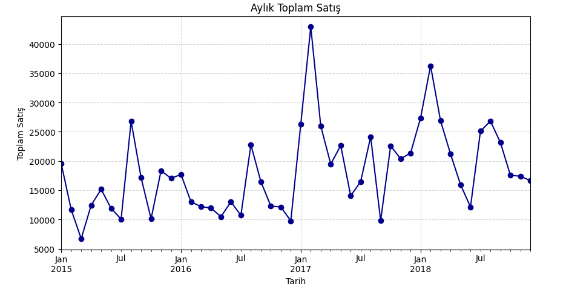
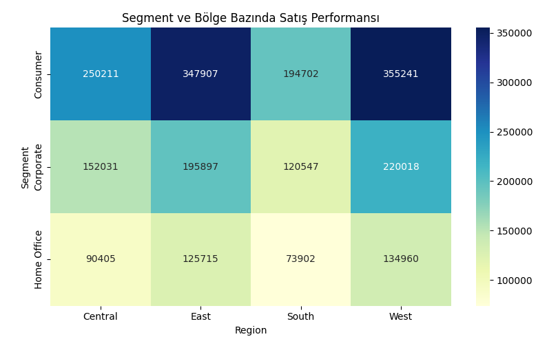

# 🛒 Superstore Satış Analizi

Bu proje, bir süpermarketin satış verileri üzerinden çeşitli analizleri içermektedir.
Superstore satış verileri üzerinde yapılan temel veri analizi çalışmasını içermektedir.  
Veri analizi Google Colab ortamında gerçekleştirilmiş, sonuçlar grafiklerle desteklenmiştir.

## 📁 Veri Seti

- `train.csv`: Satış verilerini içerir.

## 📊 Yapılan Analizler

### ✅ v1: İlk Dosya Yükleme ve İnceleme
- CSV dosyası yüklendi
- İlk 5 satır ve sütunlar incelendi

### ✅ v2: Aylık Satış Analizi
- `Order Date` sütunu datetime formatına çevrildi
- Aylık toplam satışlar hesaplandı ve grafik çizildi

### ✅ v3: En Çok Satılan 5 Alt Kategori

- Alt kategori bazında toplam satışlar hesaplandı
- En yüksek satışa sahip 5 kategori belirlendi

### ✅ v4: Bölgesel Satış ve Teslimat Süresi Analizi

#### 📍 Bölgelere Göre Toplam Satış

#### ⏱️ Sipariş ile Gönderim Arası Gün Sayısı

### ✅ v5: Aylık Satışlar, Bölgesel Segment Analizi ve KPI Raporu

#### 📈 Aylara Göre Satış Trendleri

#### 🗺️ Segment & Bölge Kırılımında Satış Performansı

#### 📊 Özet KPI Raporu

| Metrik                 | Değer           |
|------------------------|-----------------|
| Toplam Satış           | $2261536.78     |
| Toplam Sipariş         | 4922            |
| Ortalama Sipariş Tutarı| $459.48         |
| Toplam Müşteri         | 793             |
| Ortalama Teslim Süresi | 107.01 gün      |

## 🔍 Kullanılan Teknolojiler

- Python 🐍
- Pandas
- Matplotlib
- Google Colab
- GitHub

---

## 📈 Yapılan Analizler

1. 📍 **En çok satış yapılan ilk 5 şehir**
2. 📊 **Kategoriye göre toplam satış analizi**
3. 📆 **Aylık toplam satış grafiği (resample yöntemiyle)**
4. 🔎 Eksik veri ve tarih biçimi kontrolü (`errors='coerce'` kullanıldı)

---

## 🚀 Nasıl Kullanılır?

1. Bu repoyu `git clone` ile bilgisayarına çekin.
2. `superstore_analysis_v3.ipynb` dosyasını Google Colab ya da Jupyter Notebook ile açın.
3. Gerekli kütüphaneleri yükleyin ve hücreleri çalıştırın.

---

## 📌 Notlar

- Bu analiz, başlangıç düzeyinde veri görselleştirme ve zaman serisi analizi çalışmasıdır.

## 👨‍💻 Geliştirici

- Yasin Bağrıaçık  
- [GitHub Profilim](https://github.com/yassinbagriacik)

---
